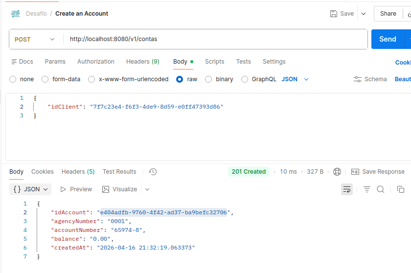
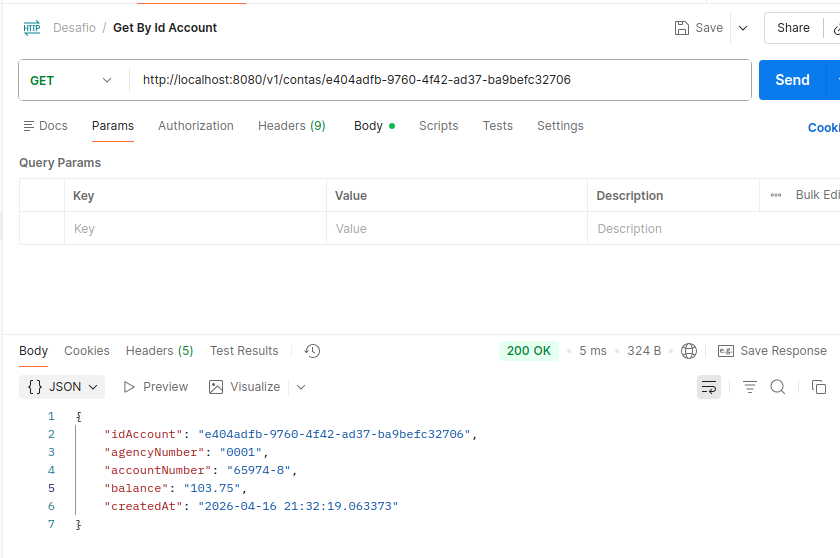
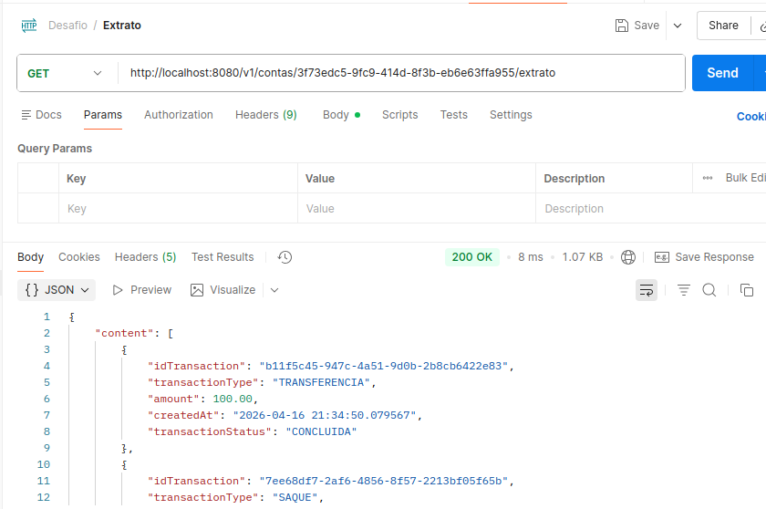
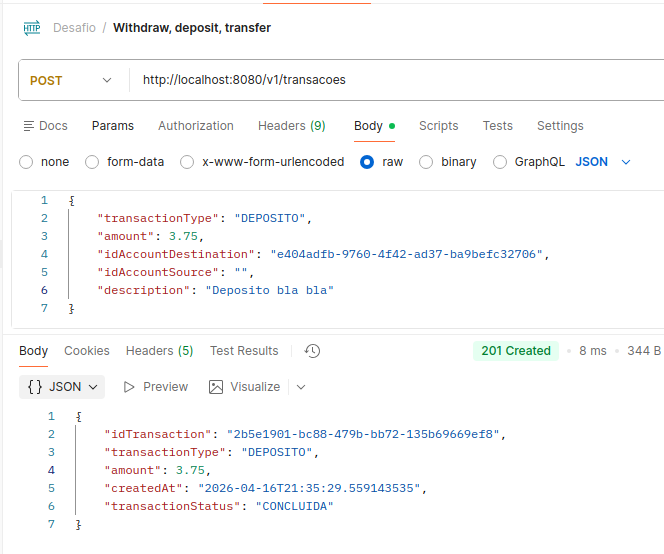

# 💰 API de Movimentações Financeiras

API REST desenvolvida em Java com Spring Boot que simula operações bancárias de uma fintech, permitindo a gestão de contas e movimentações financeiras como depósitos, saques e transferências.

---

## 🚀 Objetivo

Este projeto foi desenvolvido com foco em demonstrar boas práticas no desenvolvimento de APIs REST, incluindo:

- Organização em camadas (Controller, Service, Repository)
- Tratamento de exceções com padrão RFC 7807 (`ProblemDetail`)
- Regras de negócio (ex: saldo insuficiente)
- Documentação com OpenAPI/Swagger

---

## 🛠️ Tecnologias utilizadas

- Java 21
- Spring Boot
- Spring Web
- Spring Data JPA
- Hibernate
- PostgreSQL (ou outro banco relacional)
- Maven
- OpenAPI / Swagger
- IntelliJ IDEA

---

## 📌 Funcionalidades

- ✔️ Criação de contas vinculadas a um cliente
- ✔️ Consulta de saldo
- ✔️ Extrato de transações
- ✔️ Depósito
- ✔️ Saque
- ✔️ Transferência entre contas

---

## 📡 Endpoints principais

### 🧾 Criar conta
```http
POST /v1/contas
```

### 🔍 Consultar conta
```http
GET /v1/contas/{idConta}
```

### 💸 Realizar transação
```http
POST /v1/transacoes
```

Tipos:
- `DEPOSITO`
- `SAQUE`
- `TRANSFERENCIA`

### 📄 Extrato
```http
GET /v1/contas/{idConta}/extrato
```

---

## 📸 Exemplos da API em funcionamento

### 🔹 Criação de conta


### 🔹 Consulta de conta


### 🔹 Extrato


### 🔹 Transação



---

## ⚙️ Como rodar o projeto

### 📋 Pré-requisitos
- JDK 21
- IntelliJ IDEA
- Maven
- Postman ou similar

### ▶️ Passos

```bash
# Clonar o repositório
git clone https://github.com/lucasb2b/api-movimentacao-financeira.git

# Entrar na pasta
cd api-movimentacao-financeira
```

Abra o projeto no IntelliJ e execute a classe principal:

```bash
Application.java
```

A API estará disponível em:

```
http://localhost:8080
```

---

## 📚 Documentação da API

A API segue o padrão OpenAPI 3.0 e pode ser facilmente integrada com Swagger.

Regras principais:
- Depósito → requer `idContaDestino`
- Saque → requer `idContaOrigem`
- Transferência → requer ambos

---

## ⚠️ Tratamento de erros

A API utiliza o padrão **RFC 7807 (Problem Details)** para respostas de erro:

```json
{
  "title": "Conflito de Regra de Negócio",
  "status": 409,
  "detail": "Saldo insuficiente para realizar a transferência."
}
```

---

## 🧠 Regras de negócio implementadas

- Não permite saque com saldo insuficiente
- Validação de campos obrigatórios por tipo de transação
- Controle de consistência entre contas de origem e destino

---

## 📈 Possíveis melhorias

- [ ] Autenticação com JWT
- [ ] Testes automatizados (JUnit / Mockito)
- [ ] Dockerização da aplicação
- [ ] Deploy em cloud (AWS, Render, etc)
- [ ] Rate limiting / segurança

---

## 👨‍💻 Autor

Lucas Brito e Lima  
🔗 https://github.com/lucasb2b

---

## ⭐ Considerações finais

Este projeto demonstra a construção de uma API robusta com foco em regras de negócio reais, organização de código e boas práticas de mercado.